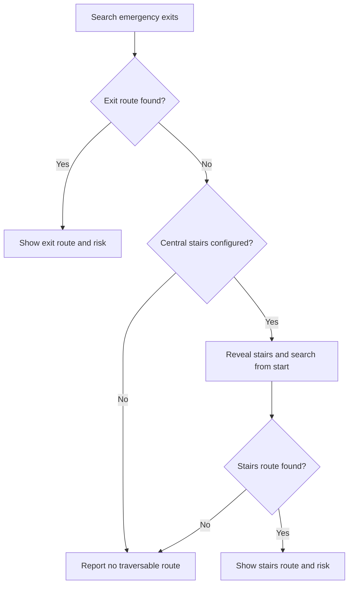

# Campus Emergency Evacuation Route Planner

**UIU AI Lab Project · Week 3 · Central-Stairs Fallback**

A campus evacuation simulation using **A\*, BFS, DFS, UCS, and Greedy Best First Search**. The planner compares routes through a floor grid containing smoke, crowds, fire, and blocked corridors, with live search visualization in Streamlit.

Week 3 addresses a specific campus scenario: **when every emergency exit is unreachable, reveal the central stairs and search for a route there using the same algorithm**. The returned route is labelled safe in the model or risky; fire and blocked cells remain impassable.


> The supplied 6 × 6 grid is a synthetic demonstration inspired by the UIU campus problem, not a surveyed UIU floor plan. Central stairs are placed at `(2, 3)`. The simulation ends at the stairs on the current floor; it does not establish that onward evacuation is possible. Hazards are configured snapshots; “live” refers to search and route animation.

## Features

- Multiple emergency exits and configurable central stairs.
- Exit-first routing, with stairs revealed only when fallback begins.
- Weighted smoke/crowd costs and explicit route-risk reporting.
- Five algorithms using one shared destination policy.
- Animated node exploration and movement along the final route.
- Comparison unlocked after all five algorithms run on the same configuration.
- Comparison charts and CSV export with destination, risk, cost, steps, search effort, and timing.
- Clear validation errors and no-route handling, including blocked stairs.

## Quick start

Extract the ZIP and open a terminal in the project folder. Use **Python 3.10+**.

### Linux / macOS

```bash
python3 -m venv venv
source venv/bin/activate
python -m pip install -r requirements.txt
python -m pytest -q
python -m streamlit run app.py
```

### Windows PowerShell

```powershell
py -m venv venv
.\venv\Scripts\python.exe -m pip install -r requirements.txt
.\venv\Scripts\python.exe -m pytest -q
.\venv\Scripts\python.exe -m streamlit run app.py
```

Using the environment's Python directly on Windows avoids activation-policy changes. Open [http://localhost:8501](http://localhost:8501) when Streamlit starts. Create a fresh environment on each machine; the distribution excludes virtual environments and caches.

### Command-line demonstration

```bash
python main.py
python main.py --scenario "Risky stairs fallback" --algorithm "UCS"
python main.py --scenario "No traversable destination"
```

The default CLI scenario blocks both exit corridors. It prints the route, destination, risk, cost, and total node expansions using the same routing policy as the dashboard.

## How the stairs fallback works



1. Search all traversable emergency exits with the selected algorithm.
2. If none can be reached, reveal **CS** and search the staircase from the **original start**, with the same hazards and algorithm.
3. Classify the actual returned route, including hazards on the destination.
4. If the stairs are also blocked or unreachable, report **no traversable route** without fabricating a path.

A reachable emergency exit keeps priority even if its route is risky or the stairs are closer. Fallback is triggered by **unreachability**, not route cost. Stairs are a separate fallback destination and are never silently added to the normal exit list.

The two search animations show planning. The traveler moves only after a final route is available. If all destinations in a stage are blocked, that stage finishes immediately with zero node expansions. Maps without a staircase remain supported and correctly report that it is not configured when exits fail.

## Movement, costs, and risk

Coordinates are zero-based **`(row, column)`**. Movement is up, down, left, or right.

| Cell | Entry cost | Traversable? |
|---|---:|:---:|
| Normal corridor | 1 | Yes |
| Crowd | 3 | Yes |
| Smoke | 8 | Yes |
| Fire | — | No |
| Wall / blocked cell | — | No |

Route cost sums the cells entered **after the starting cell**. Risk classification examines the complete route, including its destination.

| Status | Meaning | Display |
|---|---|---|
| **Safe (model)** | No smoke, crowd, or elevated-cost cells on the returned route | Blue route |
| **Risky** | Smoke, crowd, or elevated-cost cells on the returned route | Orange route and warning |
| **No route** | No reachable emergency exit or configured staircase | Error message; no route or numeric cost |

Costs are a simplified risk proxy. A lower-cost route is not a building-safety certification; a risky route is shown for algorithm analysis, not as evidence that walking through smoke is safe.

## Algorithms

| Algorithm | Search priority | Guarantee in this model |
|---|---|---|
| A* | Accumulated cost + nearest-target Manhattan distance | Minimum weighted route cost for the active targets |
| UCS | Accumulated cost | Minimum weighted route cost for the active targets |
| BFS | Number of moves | Fewest moves; may cross costly smoke/crowd |
| DFS | Depth-first traversal | Reachability; no shortest-path or cost guarantee |
| Greedy Best First | Nearest-target Manhattan distance | Heuristic-guided route; no optimality guarantee |

A* uses **`f(n) = g(n) + h(n)`** with weighted terrain costs. It does not multiply the heuristic by a weight greater than one. The minimum Manhattan distance to an active target is admissible because movement is orthogonal and every traversable move costs at least 1.

All five search kernels use the same shared fallback policy. A* and UCS minimize configured cost, so a hazardous route can still win when its total cost is lower. The risk label describes the route actually returned. UCS implements the accumulated-cost search used for the optimal-cost baseline; there is no separate Dijkstra implementation in this build.

## Demo scenarios

Start with **Room A → A\***. Choose **Fast** for animation or **Instant** for immediate results.

| Scenario | Expected behavior from Room A |
|---|---|
| Normal conditions | Emergency exit route; CS hidden |
| Smoke near north exit | Weighted exit search; no fallback while an exit is reachable |
| North corridor blocked | Route to a reachable emergency exit |
| All exit corridors blocked (stairs fallback) | Both exit corridors disconnected; CS revealed and reached |
| Both emergency exits on fire | Blocked exit markers; search central stairs |
| Risky stairs fallback | Smoky stairs reached with an orange route and risk warning |
| No traversable destination | Exits and stairs on fire; no traversable route |

In the corridor-blocking demonstration, fire occupies `(0,3)`, `(4,4)`, and `(5,4)`. A* from Room A reaches stairs at `(2,3)` in **7 moves**, with **cost 7** and no smoke/crowd exposure. BFS and Greedy choose a shorter smoke-containing route in this layout and are correctly labelled risky.

### Run a comparison

1. Run each algorithm, or click **Run Remaining for Comparison**.
2. Comparison unlocks at **5/5**, including valid no-route results.
3. Inspect destination, fallback status, risk, smoke/crowd counts, steps, cost, node expansions, and execution time; download the CSV.
4. Change the scenario, start, or custom hazards to begin a new experiment. Algorithm and playback-speed changes preserve results for the same experiment.

Search metrics include both stages when fallback is used. A cell explored in each stage counts once per stage. Timing excludes playback and a single tiny-grid run is not a robust performance benchmark. Missing route costs are omitted from cost charts instead of plotted as zero.

### Edit hazards

Enter coordinates as `row,column; row,column`. For example, enter **`0,5; 5,5`** in the Fire field to block both exits. Blocked cells can also obstruct exits or stairs.

Preset hazards remove affected rooms from the start dropdown. Custom hazards on the selected start, outside the map, on permanent barriers, or overlapping another custom hazard are rejected. Hazard updates are atomic: a rejected batch preserves the previous grid and hazards.

## Configuration and architecture

`data/map.json` stores dimensions, base grid, named locations, exits, and the optional `central_stairs` coordinate. The staircase must be in bounds, walkable in the base map, and distinct from emergency exits; a scenario may subsequently block it.

`data/scenarios.json` accepts `crowd`, `smoke`, `blocked`, and `fire` coordinate lists. Preset overlays apply in that order, so fire wins overlapping presets. Base-map walls and permanent fire cannot be overwritten by hazard overlays.

| File / directory | Responsibility |
|---|---|
| `app.py` | Streamlit controls, animation, result state, comparison, CSV |
| `main.py` | CLI demonstration |
| `src/routing.py` | Exit-first / stairs-second policy, stage metrics, risk classification |
| `src/grid.py`, `src/scenarios.py` | Map validation, movement, scenario and custom hazards |
| `src/astar.py`, `src/ucs.py` | Weighted-cost search |
| `src/bfs.py`, `src/dfs.py`, `src/greedy.py` | Other search algorithms |
| `src/heuristic.py`, `src/cost.py` | Manhattan estimates and path cost |
| `src/evaluation.py` | Algorithm registry and comparison data |
| `src/visualization.py` | Map, conditional CS marker, hazards, route colors |
| `data/` | Floor map and scenarios |
| `tests/` | Algorithm, fallback, validation, visualization, and dashboard tests |
| `docs/images/` | Generated route illustrations |
| `docs/VALIDATION.md` | Final inspection findings, fixes, and test evidence |

The UI and CLI call the shared routing policy, which supplies each unchanged search algorithm with its current target set. Visualization and evaluation consume the returned route and stage results.

## Validation

**256 tests passed** on 3 October 2026, using Python 3.12.14. Run them with:

```bash
python -m pytest -q
```

Coverage includes all five algorithms across the seven scenarios and four named locations; independent reachability and path checks; A* / UCS cost agreement; blocked, unreachable, or missing stairs; hazardous destinations; animation and CS visibility; Streamlit comparison/reset behavior; and rejected hazard batches preserving state.

Validated dependency versions: **Streamlit 1.64.0 · pandas 2.3.3 · Matplotlib 3.11.2 · pytest 8.4.2**. `requirements.txt` retains compatible version ranges. See [the validation record](docs/VALIDATION.md) for the final review details.

## Development history

| Phase | Delivered work |
|---|---|
| Week 1 | Grid foundation, A* and BFS, initial visualization |
| Week 2 | Multiple exits, hazards, five algorithms, Streamlit animation, comparison and CSV |
| Week 3 | Conditional stairs fallback, route-risk reporting, destination blocking, validation and regression coverage |

The agreed Week 3 scope is complete. See [WEEK3_TEAM_GUIDE.md](WEEK3_TEAM_GUIDE.md) for integration and demo steps. One feature branch with team review is sufficient for this integrated change; separate branches are useful for independent edits.

[WEEK2_TEAM_GUIDE.md](WEEK2_TEAM_GUIDE.md) and the original proposal document are historical planning references. The presentation has been aligned with the five-algorithm implementation and Week 3 fallback; this README describes the delivered behavior.

## Model boundaries

This is a **single-floor academic simulation with static hazards**. Fire spread, live sensors, concurrent evacuees, stair capacity, other floors, and outdoor assembly routes are outside the agreed scope. A real campus application needs verified floor plans and building-specific validation beyond this demonstration.
