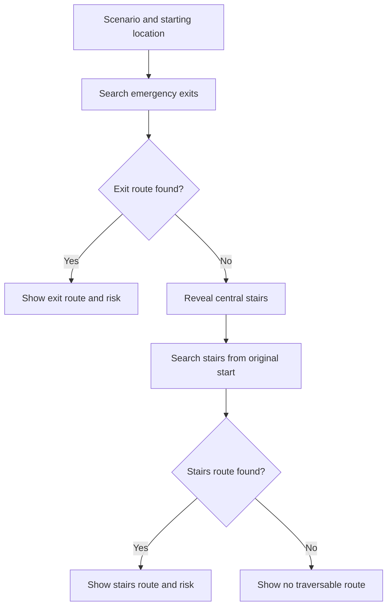
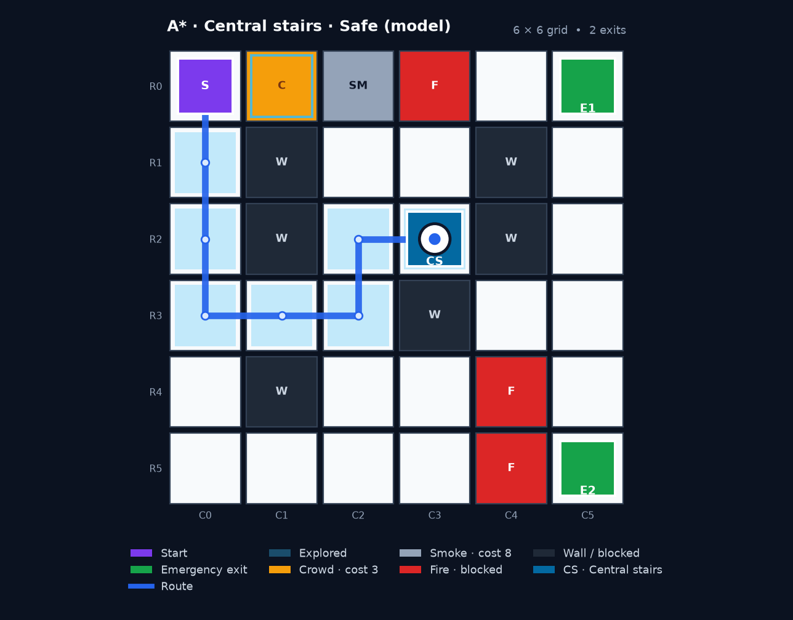
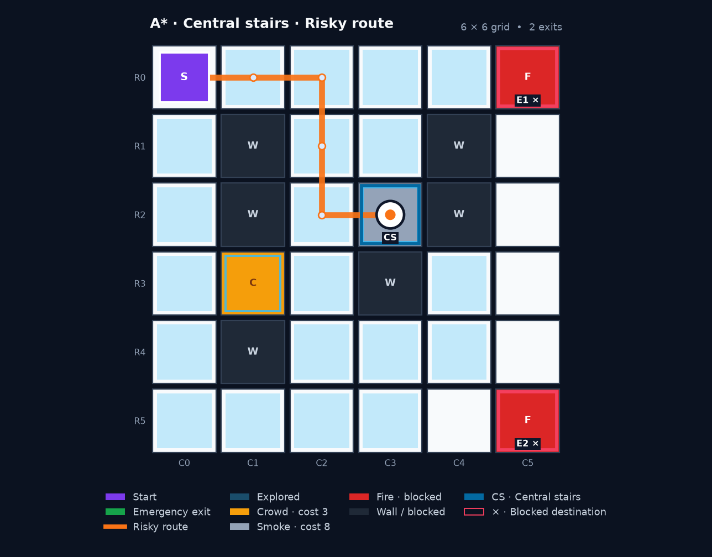
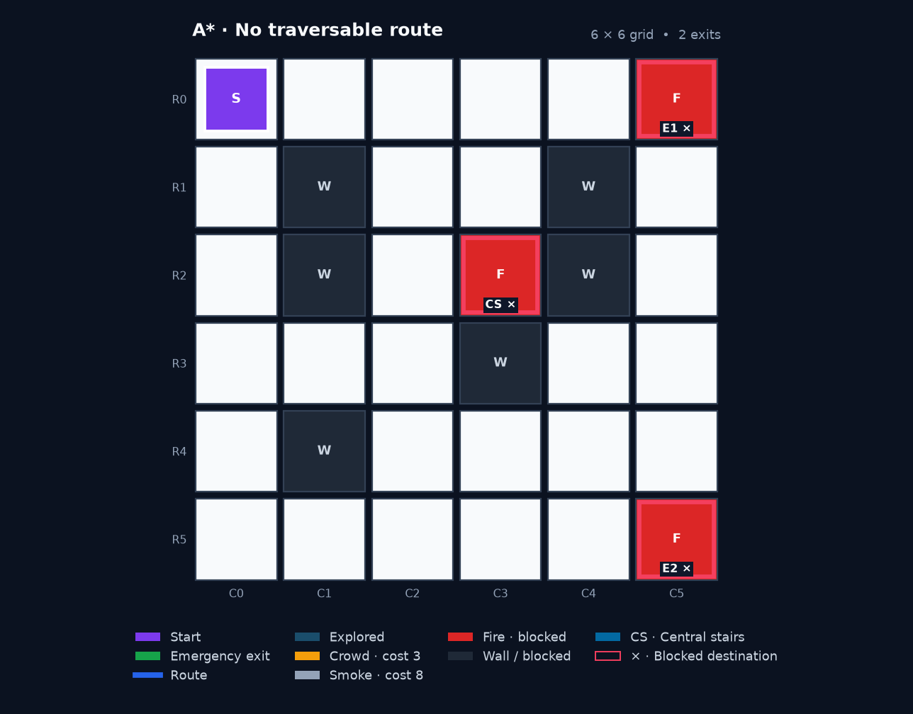

# Campus Emergency Evacuation Route Planner

**AI Lab · Week 3 final development · Emergency exits with central-stairs fallback**

A campus-floor simulation that compares five AI search algorithms under smoke, crowd, fire, and blocked corridors. The planner first searches for an emergency exit. If **every emergency exit is unreachable**, it reveals the floor's central staircase and uses the **same selected algorithm** to find a route there.

This build preserves the Week-2 Streamlit dashboard, search animation, route movement, algorithm comparison, and CSV export. Week 3 adds one focused feature: a central-stairs fallback with an honest route-risk status.

> **Map assumption:** The supplied 6 × 6 grid is a synthetic model inspired by the UIU campus scenario, not a surveyed UIU floor plan. Central stairs are placed at `(2, 3)` for this demonstration. Replace that coordinate and the map with verified building information before making any real-world interpretation. Reaching the stairs on this floor does not demonstrate that onward evacuation is possible.

## What the system does

- Searches all traversable emergency exits before considering the staircase.
- Activates the fallback when exits themselves are fire/blocked **or** their access corridors are disconnected.
- Keeps central stairs hidden on the grid during normal exit search; shows **CS** when fallback search begins.
- Restarts planning from the original starting cell, using the unchanged hazard map and selected algorithm.
- Allows smoke/crowd routes while clearly marking their risk.
- Never traverses fire, walls, or custom blocked cells.
- Reports **no traversable route** if the staircase is also blocked or unreachable.
- Animates emergency-exit search, staircase search when needed, and then movement along the final route.
- Records destination, risk, cost, search effort, timing, and both search stages.
- Unlocks comparison only after all five algorithms complete on the same map configuration.

## Destination policy



**Important details:**

1. A reachable emergency exit keeps priority even if its route contains smoke/crowd and the staircase is closer. Fallback is triggered by **unreachability**, not distance or a high route cost.
2. The search animation shows planning. The evacuee does not first walk into a failed exit corridor and then teleport back. Movement starts only after the final route is known.
3. A blocked destination is removed from search targets. If all targets in a stage are blocked, that stage finishes immediately with zero node expansions.
4. The staircase is a separate fallback destination; it is not silently added to the normal emergency-exit list.

## Movement and risk model

Coordinates use **zero-based `(row, column)`** indexing. Movement is up, down, left, or right; diagonal moves are excluded.

| Cell | Entry cost | Traversable? | Route status when used |
|---|---:|:---:|---|
| Normal corridor | 1 | Yes | Safe in the model |
| Crowd | 3 | Yes | Risky |
| Smoke | 8 | Yes | Risky |
| Fire | — | No | Never part of a route |
| Wall / custom block | — | No | Never part of a route |

Route cost is the sum of the cells **entered after the starting cell**. Smoke/crowd exposure includes the destination cell, so smoky stairs cannot be reported as a safe route.

| Result | Meaning | Presentation |
|---|---|---|
| **Safe (model)** | The returned route contains no smoke/crowd or elevated-cost cells | Blue route; explicit status |
| **Risky** | The returned route includes smoke/crowd or elevated-cost cells | Orange route; exposure warning |
| **No route** | Neither an emergency exit nor the configured staircase is traversable from the start | Error message; no fabricated path or cost |

“Safe (model)” is a classification of the modelled cells, not a real-world building-safety guarantee. A risky route is displayed for algorithm study; this simulation does not establish that walking through smoke is safe.

## Algorithms

| Algorithm | Search priority | Guarantee in this grid model |
|---|---|---|
| A* | Accumulated entry cost + nearest-target Manhattan distance | Minimum weighted route cost for the active target set |
| UCS | Accumulated entry cost | Minimum weighted route cost for the active target set |
| BFS | Number of moves | Fewest moves; may cross costly smoke/crowd |
| DFS | Depth-first traversal | Finds a reachable target; no shortest/cost guarantee |
| Greedy Best First | Nearest-target Manhattan distance | Heuristic-guided route; no shortest/cost guarantee |

The existing A* uses `f(n) = g(n) + h(n)` on **weighted terrain**. It does not inflate the heuristic with a weight greater than one. Manhattan distance remains an admissible estimate because every traversable move costs at least 1 and movement is orthogonal.

All five algorithms use the same fallback policy. A* and UCS minimize the sum of the configured costs, which is a simplified risk proxy; even they may choose a hazardous route if it has a lower total cost. The risk label always describes the **route actually returned**.

## Quick start

Run commands from the extracted project folder. Python **3.10+** is required; this build was validated on Python 3.12.14.

### Ubuntu / Linux / macOS

```bash
python3 -m venv venv
source venv/bin/activate
python -m pip install -r requirements.txt
python -m pytest -q
python -m streamlit run app.py
```

### Windows PowerShell

```powershell
py -m venv venv
.\venv\Scripts\python.exe -m pip install -r requirements.txt
.\venv\Scripts\python.exe -m pytest -q
.\venv\Scripts\python.exe -m streamlit run app.py
```

Using the virtual environment's Python directly on Windows avoids activation-policy changes. Streamlit normally serves the dashboard at [http://localhost:8501](http://localhost:8501).

The distribution excludes machine-specific virtual environments and caches. Create a fresh virtual environment instead of copying the old one across machines.

### Command-line demonstration

```bash
python main.py
python main.py --scenario "Risky stairs fallback" --algorithm "UCS"
python main.py --scenario "No traversable destination"
```

The default CLI demonstration uses the corridor-blocking scenario from the supplied video and prints the selected fallback destination, route, risk, cost, and total expansions.

## Week-3 demonstration

Use **Room A** as the start and **A*** first. Select **Fast** to see the staged animation, or **Instant** for immediate results.

| Scenario | Expected A* behavior from Room A |
|---|---|
| Normal conditions | Emergency exit route; CS stays hidden |
| Smoke near north exit | Weighted exit route; no fallback while an exit is reachable |
| North corridor blocked | Uses a reachable emergency exit |
| All exit corridors blocked (stairs fallback) | Matches the supplied video's fire layout; reveals CS and returns a route there |
| Both emergency exits on fire | Shows blocked exit markers and searches CS |
| Risky stairs fallback | Returns a route to smoky CS with an orange route and risk warning |
| No traversable destination | Exits and stairs are on fire; reports no traversable route |

For the supplied video layout, fire occupies `(0,3)`, `(4,4)`, and `(5,4)`. Both emergency-exit corridors are disconnected. A* from Room A returns:

```text
(0,0) → (1,0) → (2,0) → (3,0) → (3,1) → (3,2) → (2,2) → (2,3)
Destination: central stairs
Path steps: 7
Route cost: 7
Route risk: safe in the model
```

Algorithm choices can produce different routes and risks. In this particular layout, BFS and Greedy choose a shorter, smoke-containing route; their results are correctly labelled risky.

Starting locations occupied by a preset hazard are excluded from the start dropdown. For example, Cafeteria `(4,4)` is unavailable in the video's corridor-fire scenario. Custom hazards on the selected starting cell produce a clear validation error rather than an invalid route.

### Comparison and custom hazards

1. Run each algorithm individually, or click **Run Remaining for Comparison**.
2. Comparison becomes available at **5/5 completed**, including algorithms that correctly return no route.
3. The table and CSV include destination type/coordinate, fallback status, route risk, smoke/crowd counts, path steps, cost, total expansions, and execution time.
4. Changing scenario, starting location, or any custom hazard resets results. Algorithm and playback-speed changes preserve results for the same experiment.
5. Add custom hazards using `row,column; row,column`, for example fire on both exits: `0,5; 5,5`. The **Blocked cells** field can also block exits or stairs.

Route-cost charts omit unavailable routes rather than treating a missing cost as zero. Node expansions and execution time include **both** the failed exit search and the fallback search. A cell expanded in each stage is counted once per stage, not once globally. Timing excludes animation and should not be interpreted as a robust benchmark from a single tiny-grid run.

## Map configuration

`data/map.json` owns the staircase location:

```json
{
  "exits": [[0, 5], [5, 5]],
  "central_stairs": [2, 3]
}
```

The snippet shows the destination fields only; retain the full file's dimensions, start, locations, and grid. The staircase must be in bounds, walkable in the base map, and separate from emergency exits. A hazard overlay can subsequently block it. Legacy maps without `central_stairs` still load; if exits fail, they report that no staircase is configured.

`data/scenarios.json` supports `crowd`, `smoke`, `blocked`, and `fire` coordinate lists. Fire takes precedence over other preset overlays. Custom overlapping hazards are rejected with a validation message.

## Preview

The following figures are generated from the included map and A* results.

### Central-stairs fallback after exit corridors fail



### Risky fallback to smoky stairs



### No traversable destination



## Project structure

| Path | Responsibility |
|---|---|
| `app.py` | Streamlit controls, staged animation, result state, comparison, CSV |
| `main.py` | CLI demonstration using the same routing policy |
| `src/routing.py` | Shared exit-first / stairs-second policy, stage metrics, risk classification |
| `src/grid.py` | Map validation, movement costs, fire/block handling, staircase metadata |
| `src/scenarios.py` | Scenario loading, named starts, coordinate parsing, custom overlays |
| `src/astar.py`, `src/ucs.py` | Weighted-cost search implementations |
| `src/bfs.py`, `src/dfs.py`, `src/greedy.py` | Additional search implementations |
| `src/heuristic.py`, `src/cost.py` | Manhattan estimates and path cost |
| `src/evaluation.py` | Algorithm registry, normalized results, comparison data |
| `src/visualization.py` | Map, conditional CS marker, hazard-visible destination markers, route colors |
| `data/` | Floor map and emergency scenarios |
| `tests/` | Regression, routing, validation, animation, and dashboard integration tests |
| `docs/images/` | Generated figures for this README |
| `WEEK2_TEAM_GUIDE.md` | Retained Week-2 development reference |
| `WEEK3_TEAM_GUIDE.md` | Focused Week-3 integration and review guide |

The original proposal document and presentation are retained as prior project materials; their content has not been rewritten for Week 3.

## Validation

```bash
python -m pytest -q
```

**Verified result: 243 tests passed.** Coverage includes:

- The original six Week-2 regression tests.
- All five algorithms across all supplied scenarios and named starts, with invalid starts explicitly rejected.
- An independent flood-fill oracle for reachability, destination priority, route continuity, and fire/block avoidance.
- A* / UCS weighted-cost agreement for primary and fallback routes.
- Directly burning exits, corridor-isolated exits, missing/blocked/unreachable stairs, and a zero-step stairs route.
- Smoke on a destination, risk colours, blocked-destination markers, and CS visibility through both animation stages.
- Streamlit dashboard interactions: selected/all-algorithm runs, comparison locking/unlocking, invalid input, state reset, unavailable starts, and missing route costs.

Validated dependency versions: Streamlit 1.64.0, pandas 2.3.3, Matplotlib 3.11.2, and pytest 8.4.2. `requirements.txt` retains the project's existing compatible version ranges.

## Development history and team workflow

| Phase | Development focus |
|---|---|
| Week 1 | Grid-map foundation, A* and BFS, initial visualization |
| Week 2 | Multiple exits, hazards and weighted costs, five algorithms, Streamlit, live animation, comparison and CSV |
| Week 3 | Conditional central-stairs fallback, route-risk reporting, destination blocking, scenario validation and regression coverage |

Four separate Week-3 branches are **not required** for one integrated feature. A practical workflow is one team-leader feature branch, review/testing by the other members, and one pull request into `main`. Use separate branches only when members make independent code/documentation changes. Attribute contributions to the work actually performed; branch count alone does not show contribution.

## Scope and limitations

- This is a **single-floor, static-hazard academic simulation**. It does not model fire spreading over time, people moving concurrently, stair capacity, other floors, or a verified route to an outdoor assembly area.
- CS is a fallback waypoint on the current floor. Its availability here does not confirm that the staircase or lower floors are usable in a real emergency.
- Risk labels reflect the configured cells and costs. Real hazards require building-specific assessment and emergency procedures.
- No additional algorithms, external services, or deployment have been introduced in Week 3.
